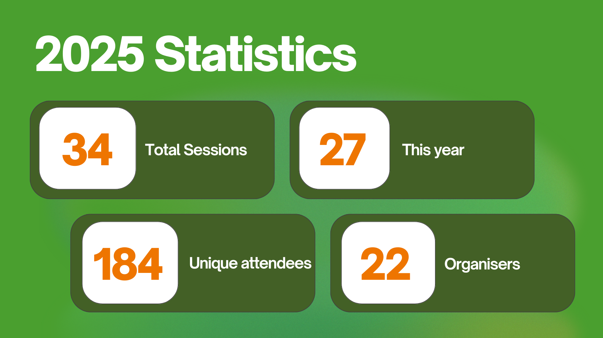
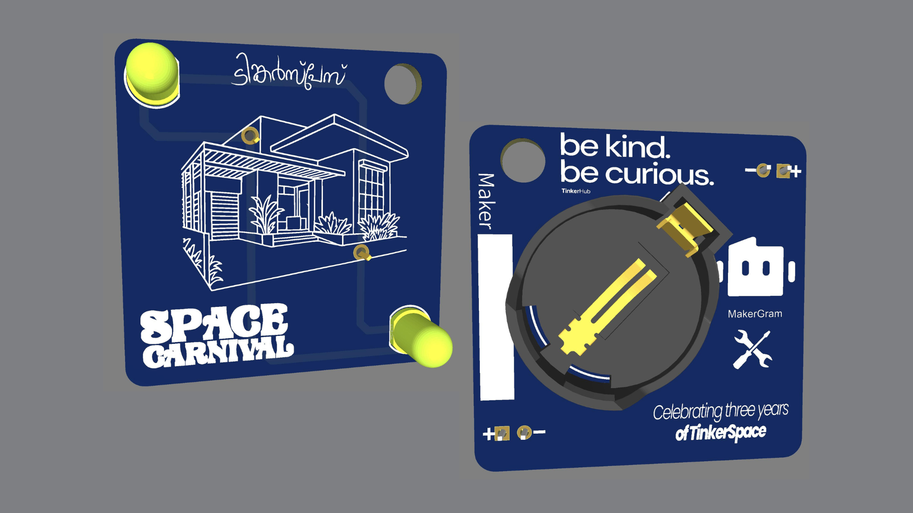
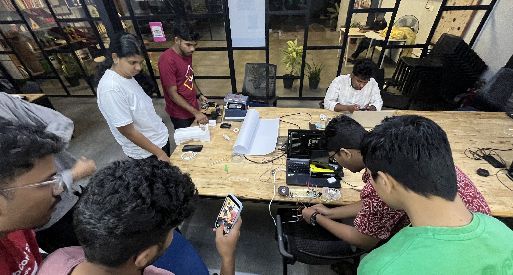
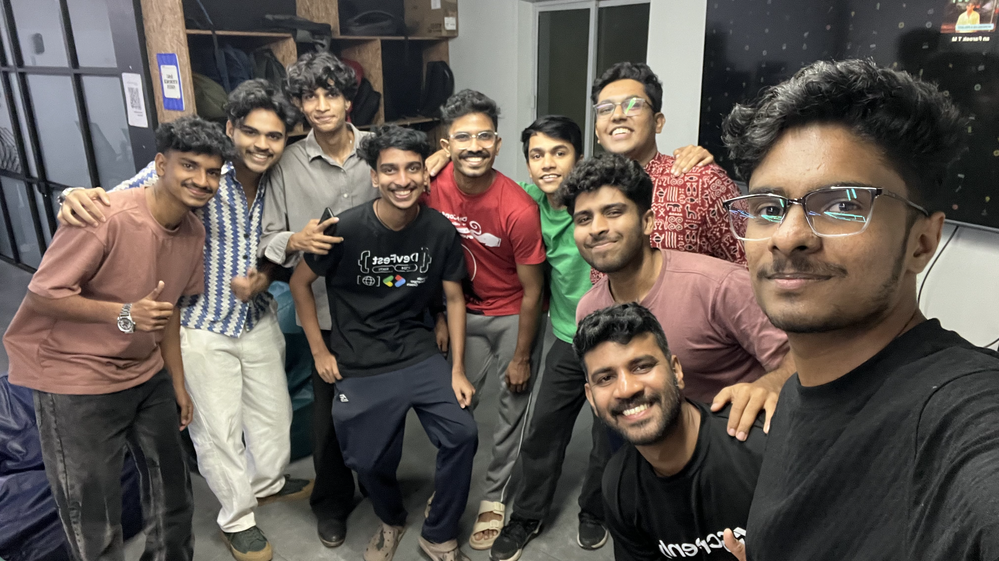

# MakerThursday 0x00: 2026 Plan for Maker Thursday, 2025 Reflections and Project showcasing.

We reflected on the 2025 event highlights and gathered feedback from the community. Throughout 2025, we hosted **27 Maker Thursday sessions**, with **184 unique attendees** and **22 different hosts**, which is a strong outcome for a community-run initiative.

While a few weeks were missed due to host unavailability, the situation improved significantly in the later quarters of 2025. More new hosts stepped up to run sessions, which became one of the key highlights of the year.

### Achievements

We discussed some of the key achivment we got from the MakerThursady using the community.

- **[Raspberry Pi Jam 2025](https://pijamkochi.in/PiJam2025/)** was organized collaboratively by the TinkerSpace and MakerGram community members. The initial discussions for the event began during a Maker Thursday session, and the planning, coordination, and finalization were all carried out within the same Maker Thursday gatherings. Even the speakers were selected from community members who volunteered to contribute. As part of this effort, we received a **Raspberry Pi 16GB** and a **1-year free subscription to Raspberry Pi Magazine**. We are truly proud of this achievement, it reflects a community-driven initiative, **built by the community, for the community**.

-  **Arduino Day 2025** Similar to Raspberry Pi Jam, Arduino Day 2025 was also organized collaboratively with TinkerSpace community members and MakerGram. The idea and planning originated from Maker Thursday discussions, with community members volunteering as speakers and contributors. [Blog Post](https://salmanfarisvp.com/blog/arduino-day-2025-kochi/) , [Event Page](https://tinkerhub.org/events/LU4PQRP6F4/Aurdino%20Day%202025).

- **Space Carnival Badge** : Creating a PCB badge had been a long-term plan for us, and we finally brought it to life at the end of the year during **TinkerSpace’s 3rd anniversary Space Carnival**. The badge was intentionally simple, using LEDs and batteries, giving curious participants an opportunity to try soldering and build their own badge.

## Future Plans

During the review and planning discussion, we aligned on the following actions for the coming year:

- **Topic Planning:** Topics and hosts should be confirmed at least **one week in advance**. If not ready, a **filler topic** will be used and an available member will host.
- **Documentation:** From 2026 onwards, **every Maker Thursday will be documented**. The host is responsible for a short journal entry, following simple guidelines, giving visibility to both the host and the community.
- **Filler Topics:** Preselected topics like **KiCad** and **MQTT** will be used when needed, with more added over time.
- **Collaborative Projects:** Encourage **community-driven hardware projects**, with support through curation and mentorship.
- **Maker Bench Integration:** Explore ways to bring **Maker Bench projects** into Maker Thursday to increase participation.
- **Physical AI Collaboration:** Work with **AI Wednesday** to explore **Physical AI**, focusing on AI running on hardware.
- **Personal Goals:** Encourage members to set personal maker goals, such as publishing projects in **Raspberry Pi Magazine** or other international platforms.

## This Week’s Project Presentation

**Ramakanth** shared **Meow Synth**, an ESP32-based mini synthesizer. Kudos to him for showcasing the project and walking us through his work.

That’s a wrap for this week. Thanks to everyone for the continued support, and we’re excited for the new year and many more builds ahead.

### Next Week’s Topic

**Document Your Project 101**
A practical session focused on how to document maker projects clearly and effectively, covering basics such as structure, photos, write-ups, and sharing work through journals and repositories.
------