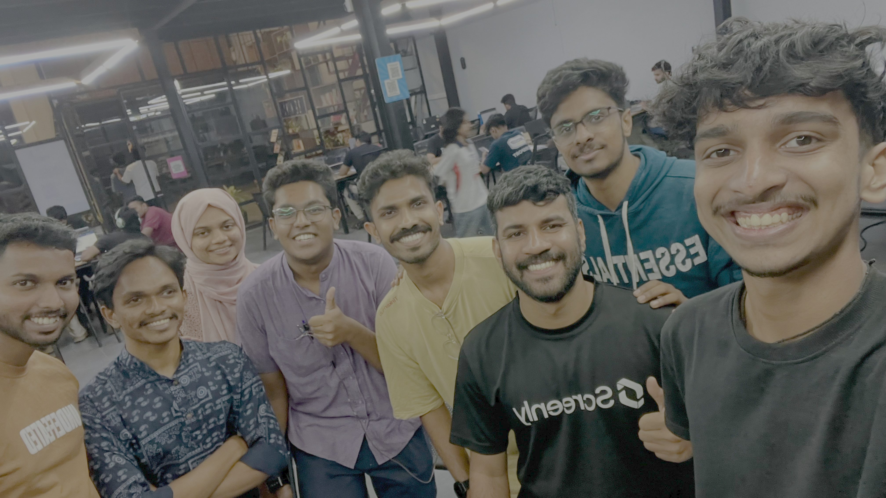

# MakerThursday 0x01: Document Your Project: Why and How?

## Overview
This Maker Thursday focused on the importance of documentation and how makers can better share their work. The session had an interactive and practical vibe, with discussions around why documentation matters and how it helps projects grow beyond just prototypes. [Salman](https://salmanfarisvp.com/) [Me] led the session and shared real-world workflows, tools, and best practices used in day-to-day maker and open source projects.

## Topics
- Why documentation matters in maker projects
- Best practices for writing clear and useful documentation
- Tools and platforms for sharing project work

## Slides

<iframe src="https://docs.google.com/presentation/d/e/2PACX-1vQyg_UCI3seXYuuH4Pf7xVKE9pjVwKEoLY9IVgLBnI1dfApraj6vnNkcN6DYKF_He7jk0RbgU3Np1ry/pubembed?start=false&loop=false&delayms=3000" frameborder="0" width="960" height="569" allowfullscreen="true" mozallowfullscreen="true" webkitallowfullscreen="true"></iframe>

## Highlights
-  Discussed practical documentation workflows and tools that can be immediately applied to personal and community projects. (The full tool list is available in the slides attached above.)

## Next Week
- Topic: "RoboWar Team" sharing their experince.
- Host: [Devadath S](https://tinkerhub.org/@dev_devadath)

------