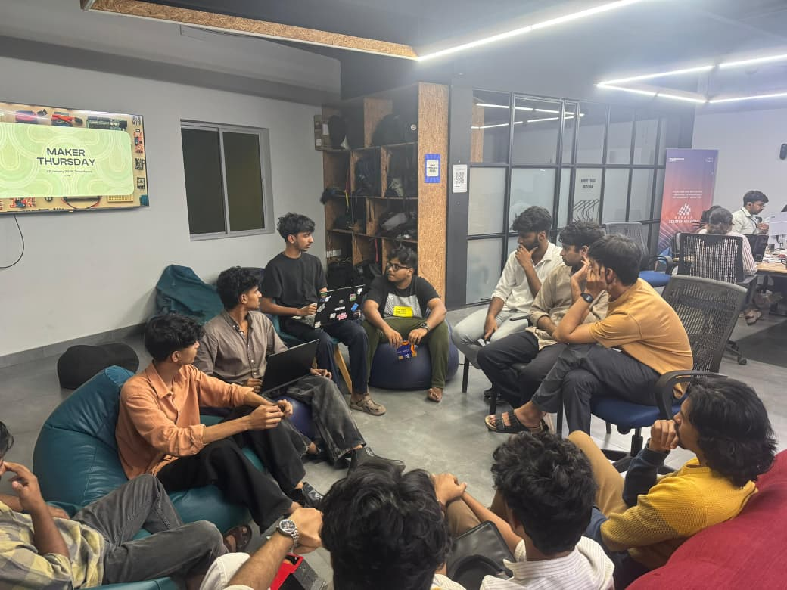
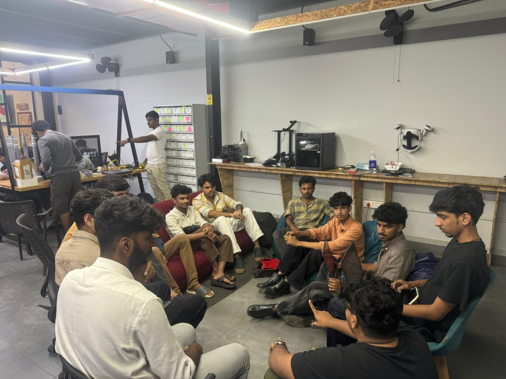

## Overview

This week’s Maker Thursday session was a project presentation day instead of a topic-based session. One of our makers presented their Robo War robotic car build for competition and shared the challenges, learnings, and fun experiences from the event.
We also had another maker who built a multi-drone system for an agriculture drone competition, and he shared his journey and key takeaways which was very inspiring and guided some of our makers to get started with drone building. The overall vibe was very inspiring, practical, and full of great community learning.

## Project Presentation

* Robo War Car Build – A combat robotic car built for a Robo War competition, shared with learnings from the build process.

* Multi-Drone Agriculture System – A drone-based project developed for an agriculture drone competition, along with real-world insights and experiences.

## Photos

## Highlights
* One key takeaway from the session was learning directly from our makers’ real competition experiences, which gave everyone practical insights and motivation to build and improve their own robotics projects.

## Next Week
- Topic: TBD
- Host: [Salman Faris](https://tinkerhub.org/@salmanfarisvp)
