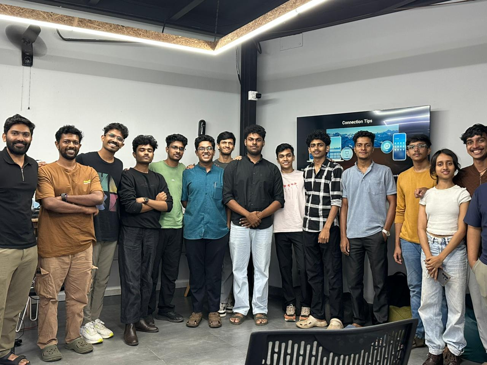

## Overview

This week’s Maker Thursday session was on audio sythesizers. Ramakanth discussed open source electronic synthesizer projects and building custom synthesizers using microcontrollers.
He shared his own open source synthesizer project Meow synth, his experience and how makers at TinkerSpace helped him build it. The session also had a demonstration where makers got hands-on experience with Meow Synth. Discussions involved makers sharing experiences on building a custom macro keyboards, audio-reactive art installations. The session motivated makers to build a their own version of synthesizers.

## Project Presentation

* Meow Synth – An open source audio synthesizer

## Photos

## Highlights
* Key takeaways from the session included practical tips on prototyping audio synthesizers, exploring open source digital audio workstations like LMN3.

## Next Week
- Topic: TBD 
- Host: TBD
