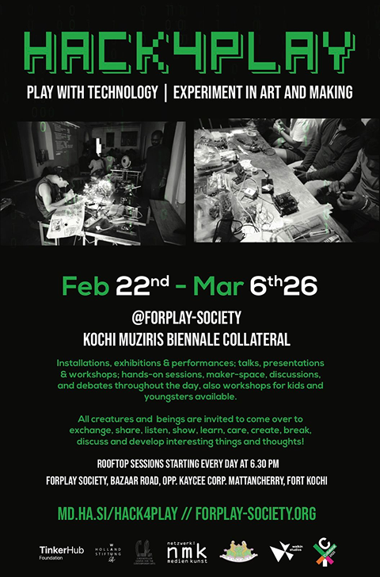
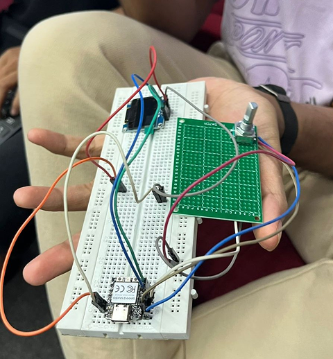
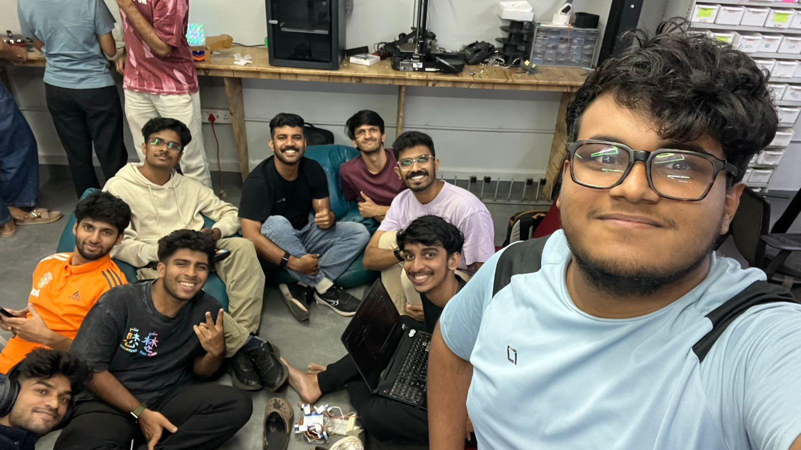

## Overview

This Maker Thursday was mostly a community sync with announcements, ownership on upcoming events, and a few project updates. We aligned on timelines for collaborations, deployments that went live, and what to prepare for the next couple of months.

## Announcements and Decisions

- **Kochi-Muziris Biennale experience zone:** [TinkerHub](https://tinkerhub.org/) will collaborate with [Forplay Society](https://forplay-society.org/) to set up an experience zone. [Jasim](https://tinkerhub.org/@jasim) and [Salman](https://tinkerhub.org/@salmanfarisvp) will take ownership, planned from **Feb 25 to Mar 1, 2026**.

- **Inventory management:** [Shaan Shoukath](https://tinkerhub.org/@shaan_shoukath) joined as the new Inventory Manager, and the parts requesting/managing site is live at [`https://makerspace-inventory-hub.vercel.app/`](https://makerspace-inventory-hub.vercel.app/).
- **Meshtastic hiking plan:** A Meshtastic hiking activity is being planned in collaboration with Seeed Studio and TinkerSpace. [Samad](https://tinkerhub.org/@abdulsamadmj) and [Jasim](https://tinkerhub.org/@jasim) will be responsible for, targeting **April 2026**.
- **Arduino Day:** Planned for **Mar 28, 2026**, with [Abhiram](https://tinkerhub.org/@abhiram) taking ownership (details to be finalized).
- **3D printer queue system:** The queue system was deployed by [Ryyan Safar](https://tinkerhub.org/@ryyansafar) (available via [`https://tinkerspace-3d-printing-queue.vercel.app/`](https://tinkerspace-3d-printing-queue.vercel.app/)).
- **Kutty Makers Camp:** Planned during working days in **April 2026** (summer). Everyone present was requested to contribute **one working day** for the event.

## Discussion

- [Devadath](https://tinkerhub.org/@dev_devadath) shared about Google’s VLM-based robotics arm work (Gemini Robotics) and related ideas for vision-guided manipulation.
- We also looked at the Seeed Studio robotics arm project: [reBot DevArm](https://github.com/Seeed-Projects/reBot-DevArm).

## Project Presentation

- DIY MacroPad: Some components have arrived, and a full presentation is planned for an upcoming Maker Thursday.

## Photos

## Highlights

- Clear ownership and timelines were set across multiple upcoming events, with a few key infrastructure updates going live for the space.

## Next Week

- Topic: TBD
- Host: TBD
