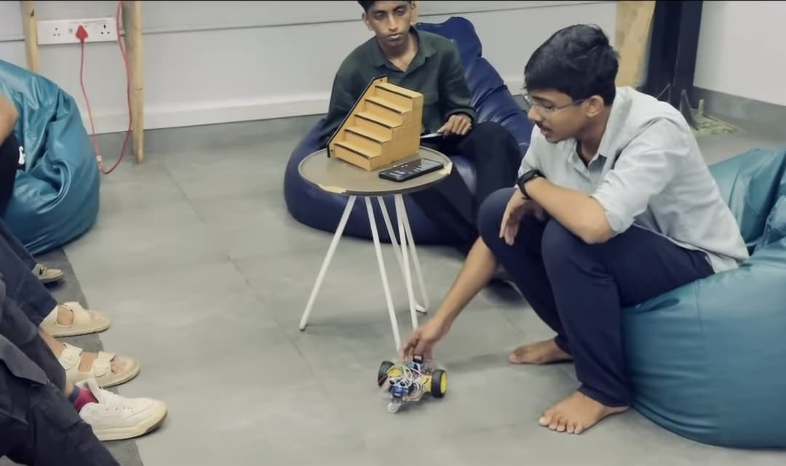
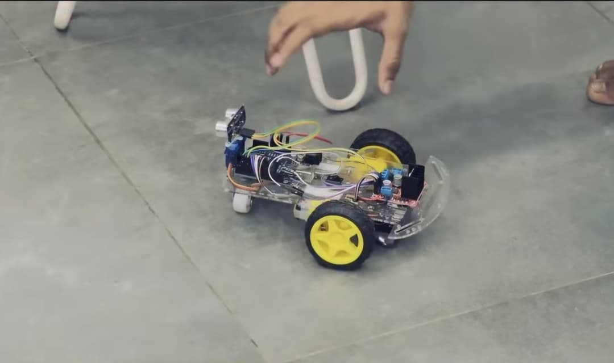
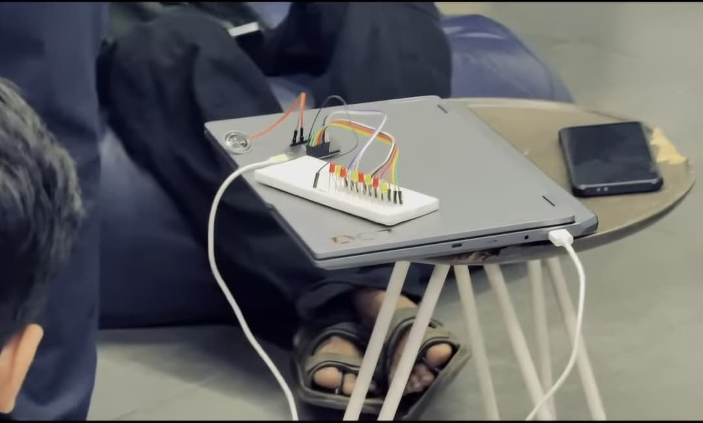

## Overview
The session served as a platform to showcase practical, real-world applications of embedded systems, robotics. [Nikhil S](https://tinkerhub.org/@nikhils) showcased his hardware prototypes which included IoT Piano, Obstacle Avoiding Robot, Smart Automated Staircase Light, Smart Shoe Module for Blind.

## Topics
- Project exhibition and live demonstrations
- Hardware architecture and microcontroller integration
- Showcasing use-cases for assistive technology, robotics, and home automation

## Project Presentation
* Nikhil showcased his prototypes on: 
    * IoT Piano (Home automation prototype) 
    * Obstacle Avoiding Robot
    * Smart Shoe Module for Blind
    * Smart Automated Staircase Light

## Photos

### Activity photo

## Highlights
-  The session provided live demonstrations and answered technical questions about the circuitry, sensors, and code.

## Next Week
- Topic: TBD
- Host: TBD

