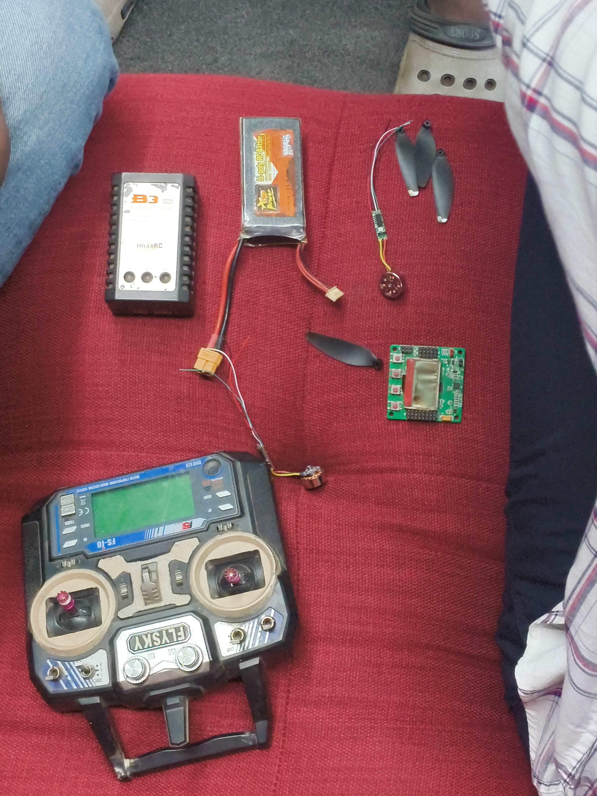

## Overview
This week’s session focused on the growing role of drones across multiple industries. The theme centered around real-world applications and basic drone engineering. The overall vibe was interactive and exploratory, with participants showing strong curiosity about how drones actually work and are built.

## Topics
- Applications of drones (photography, agriculture, surveillance, engineering)
- Basic components of a drone
- How drones function (flight control, sensors, communication)

## Project Presentation
- Team – Autonomous Drone Concept (overview of a smart drone use-case)
- Team – Basic Drone Assembly (intro to components and structure)

## Photos

### Group photo

### Activity photo

### Drone components photo

## Highlights
- Participants gained a clear understanding of how drones operate beyond just flying devices

## Next Week
- Topic: TBD
- Host: TBD
