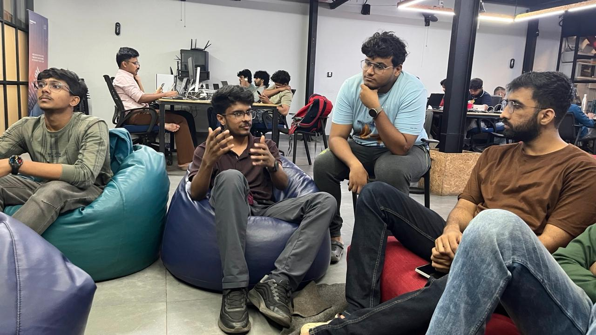
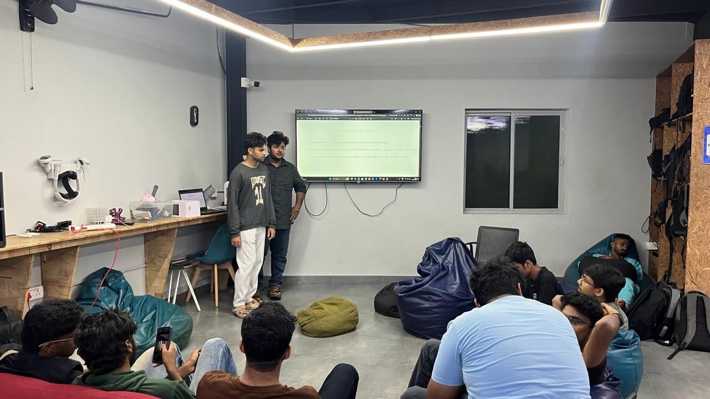

## Overview
During this Maker Thursday, we gathered to coordinate plans for Arduino Day 2026 and discuss the Arduino Uno Q. We finalized collaboration timelines and event preparations. Additionally, [Aaron](https://tinkerhub.org/@aaron_23) and [Michael](https://app.tinkerhub.org/u/MUY060N50J) showcased the latest development stages of their biomimetic Mole Crab Robot.

## Topics
- Preparations regarding Arduino Day 2026 celebration.
- Arduino UNO Q

## Project Presentation
- Mole Crab Robot: A stealth robot that uses biomimicing.

## Photos
### Group photo

### Activity photo

### Line Follower Competition Track Preparation

<video autoplay muted playsinline controls preload="auto" poster="/makerthursday/blog/assets/images/2026-03-26-maker-thursday-0x07/07_maker_thursday_project.jpeg" style="width: 100%; height: auto; max-width: 100%;">
  <source src="/makerthursday/blog/assets/images/2026-03-26-maker-thursday-0x07/07_maker_thursday_video.mp4" type="video/mp4">
  Your browser does not support the video tag.
</video>

## Highlights
- Community members prepared track for arduino day line follower competition

## Next Week
- Topic: TBD
- Host: TBD