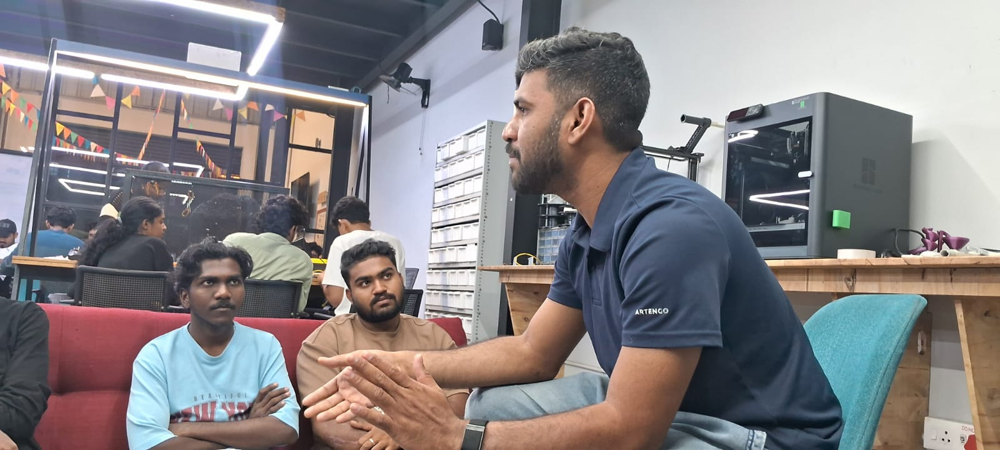
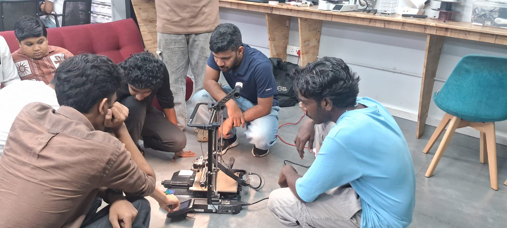

## Overview

This Maker Thursday, we tried to convert a broken 3D printer (Creality Ender-3 S1 Pro) into a CNC Plotter. This printer holds significance for our community as it was the first 3D printer we had at TinkerSpace, funded by the Kerala Startup Mission.

During the session, [Salman Faris](https://tinkerhub.org/@salmanfarisvp) explained the fundamentals of how a 3D printer works, detailing its various components such as the extruder, print bed, and stepper motors. We then powered on the printer and confirmed it was working, though we discovered some issues with the limit switch that will need to be resolved.

## Topics
- How a 3D printer works, its main parts (extruder, print bed, etc.).
- Converting a Creality Ender-3 S1 Pro 3D printer into a CNC Plotter.

## Project Presentation
- **CNC Plotter Conversion**: Repurposing a broken Creality Ender-3 S1 Pro 3D printer.

## Photos

### Activity photo

## Highlights
- Basics of 3D printers and its working
- Successfully powered on the Creality Ender-3 S1 Pro and identified the limit switch issue.

## Next Week
- Topic: TBD
- Host: TBD