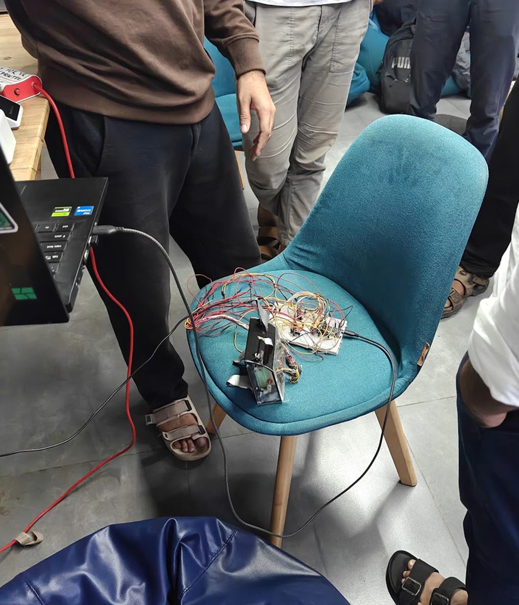
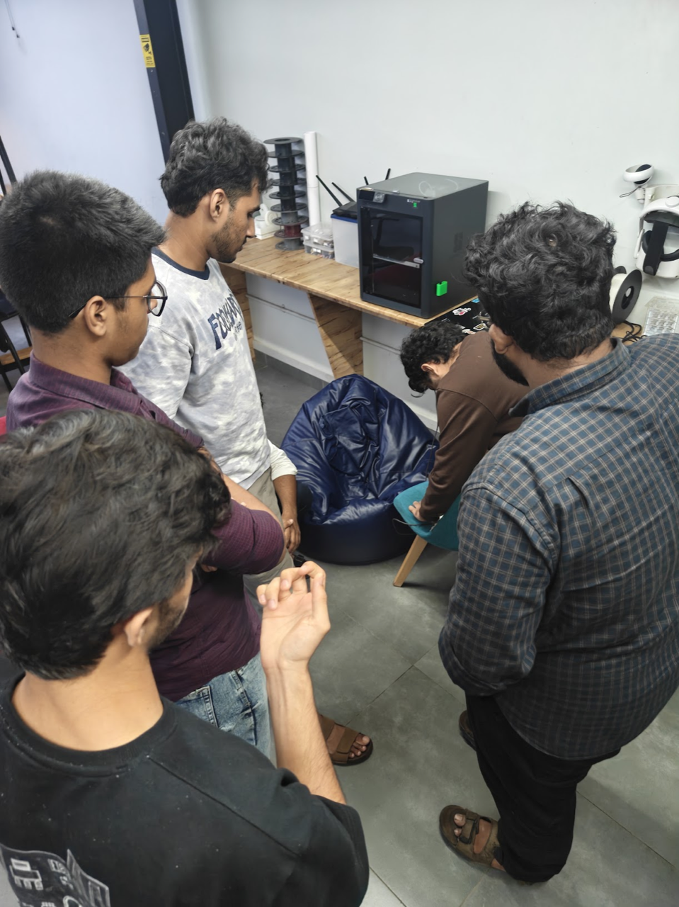

## Overview
This session centered on understanding open-source software and hardware licensing models. We examined how different licenses dictate code usage, distribution, and intellectual property rights, alongside discussing the ongoing licensing and patent dispute between Bambu Lab and the 3D printing community. The session concluded with a project presentation of the Mole Crab robot by [Aaron Scaria](https://tinkerhub.org/@aaron_23) and [Micheal John Antony](https://app.tinkerhub.org/u/MUY060N50J).

## Topics
- **Open Source Licensing:** Types of open-source licenses, comparative breakdown, and their impact on code usage and IP.
- **Bambu Lab vs. 3D Printing Community:** Discussion on the patent notice, open-source licensing disputes, and community implications.

## Project Presentation
- **Mole Crab Robot:** Presented by [Aaron Scaria](https://tinkerhub.org/@aaron_23) and [Micheal John Antony](https://app.tinkerhub.org/u/MUY060N50J), demonstrating the design and mechanics of their biomimetic robot prototype.

## Photos

### Mole Crab Robot

## Highlights
- Explored open-source licensing nuances and legal implications for makers.
- Showcased a unique biomimetic robotics project.

## Next Week
- Topic: TBD
- Host: TBD
