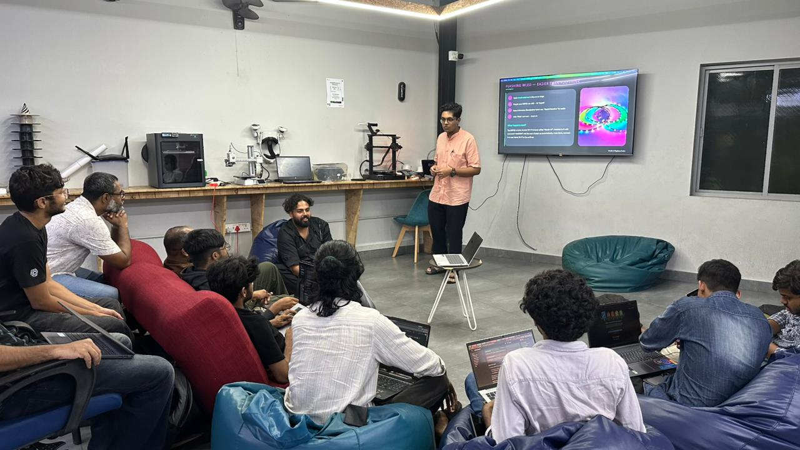
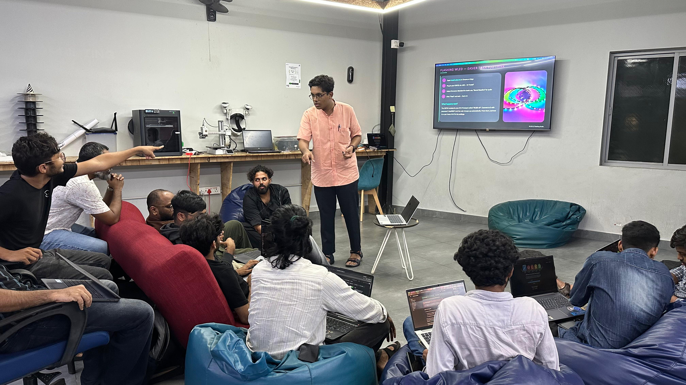

## Overview

This Maker Thursday we discussed [WLED](https://kno.wled.ge/)—an open-source, web-controlled firmware project that allows users to control WS2812B LED strips, matrices, and other addressable LEDs using microcontrollers like the ESP32. 

We focused on how WLED is beginner-friendly, making it easy to build lighting projects without writing any code. For the hands-on session, participants flashed the WLED firmware onto an ESP32 and set up 8x8 LED matrices to see their custom lights in action.

## Topics
- Introduction to **WLED** and its initial setup.
- The difference between normal LED strips and addressable **WS2812B** LED.
- Controller requirements: Although WLED still supports the ESP8266, the ESP32 is recommended for new setups to support advanced features like audio reactivity, multiple LED output pins and higher LED counts.
- Controlling WLED: web application dashboard, native Android & iOS mobile apps, and integration options (like Home Assistant).

## Project Presentation
- **WLED ESP32 Controller Setup**: Flashing WLED firmware and configuring 8x8 addressable LED matrices.

## Photos

### Activity photo

## Highlights
- Participants flashed WLED to an ESP32 and configured 8x8 LED matrices.
- Explored built-in animations, color palettes, and segments.

## Next Week
- Topic: TBD
- Host: TBD

