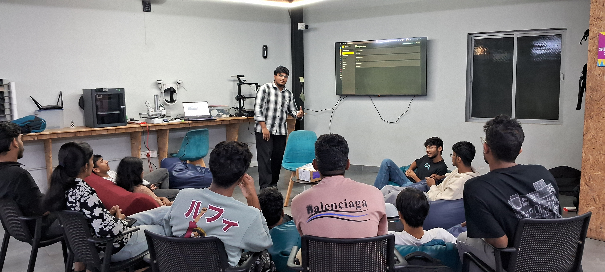

## Overview

This Maker Thursday, hosted by [Shaan Shoukath](https://github.com/Shaan-Shoukath), we discussed the systems, logistics, and challenges behind managing makerspace inventory. During the session, we also discussed [SpaceWorks](https://github.com/SpaceWorks-HQ/SpaceWorks) a digital inventory platform designed by Shan to simplify tracking and managing resources in a makerspace.

## Topics
- **Makerspace Inventory Management:**  Categorization, monitoring, and keeping track of hardware components and kits.
- **Tool Tracking & Workflows:** Methods for tool management, check-in/check-out processes, and procurement.

## Project Presentation
- **SpaceWorks**: An open-source inventory management platform built by Shan ([SpaceWorks-HQ/SpaceWorks](https://github.com/SpaceWorks-HQ/SpaceWorks)) designed for tracking makerspace resources and tools. Shan discussed how makerspaces track their hardware and shared that the project is built as a template that can be used by any makerspace.

## Photos

### Session photo

## Highlights
- Discussed the need for structured inventory systems in shared maker spaces.
- Demoed the **FRDM-MCXN236** development board, received as part of the NXP [FRDM to Innovate – On us!](https://community.nxp.com/t5/FRDM-Training-Hub/FRDM-to-Innovate-On-us/ta-p/2175227?profile.language=en) campaign.

## Next Week
- Topic: TBD
- Host: TBD
